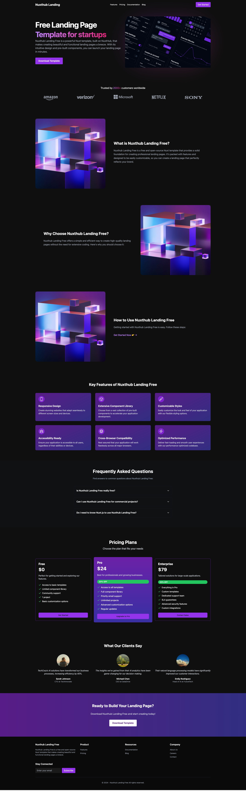
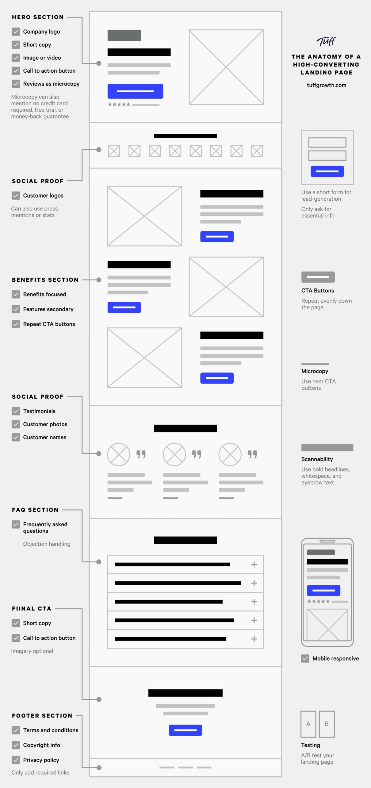

# Nuxt 3 Modern Landing Page Template

This is a sleek and responsive landing page template crafted with Nuxt 3 and enhanced by Shadcn UI components.



## Getting Started

First, install the project dependencies:

```bash
# Using npm
npm install

# Using pnpm
pnpm install

# Using yarn
yarn install

# Using bun
bun install
```

## Local Development

Launch the development server on `http://localhost:3000`:

```bash
# Using npm
npm run dev

# Using pnpm
pnpm run dev

# Using yarn
yarn dev

# Using bun
bun run dev
```

## Preparing for Production

Build your application for production:

```bash
# Using npm
npm run build

# Using pnpm
pnpm run build

# Using yarn
yarn build

# Using bun
bun run build
```

To preview your production build locally:

```bash
# Using npm
npm run preview

# Using pnpm
pnpm run preview

# Using yarn
yarn preview

# Using bun
bun run preview
```

## Customizing Your Landing Page

Tailor the content of your landing page by modifying the `data/demo.ts` file.

For style customizations, explore and edit the files in the `templates/shadcn/` directory.

To create additional pages, add a new `page.vue` file in the `pages` folder:

```vue
<template>
  <Landing :page="page" />
</template>

<script setup lang="ts">
import Landing from "@/templates/shadcn/pages/landing.vue";
import { page } from "@/data/demo";
</script>
```

## Creating Your Own Template

Want to design a unique template? Create a new folder in the `templates` directory with this structure:

```
your-template-name
├── assets
│   ├── css
│   │   └── style.css
│   └── imgs
│       └── logo.png
├── components
│   ├── cta
│   │   └── index.vue
│   ├── faq
│   │   └── index.vue
│   ├── feature
│   │   └── index.vue
│   ├── footer
│   │   └── index.vue
│   ├── header
│   │   └── index.vue
│   ├── hero
│   │   └── index.vue
│   ├── pricing
│   │   └── index.vue
│   ├── section
│   │   └── index.vue
│   ├── testimonial
│   │   └── index.vue
│   └── usercase
│       └── index.vue
└── pages
    └── landing.vue
```

Use this image as a guide to organize your content in `pages/landing.vue`:

This structure has been proven to have an extremely high conversion rate.


## Acknowledgements

This template is built upon the following amazing technologies:

- [Nuxt 3](https://nuxt.com) - The Intuitive Vue Framework
- [Shadcn UI](https://ui.shadcn.com) - Beautifully designed components
- [Shadcn UI Pro](https://pro.shadcn.net) - Premium components and templates

If you use this Landing Page Template in your project, we kindly ask you to credit [Shadcn UI Pro](https://pro.shadcn.net).

For more information on deploying your Nuxt 3 application, refer to the [Nuxt 3 deployment documentation](https://nuxt.com/docs/getting-started/deployment).
